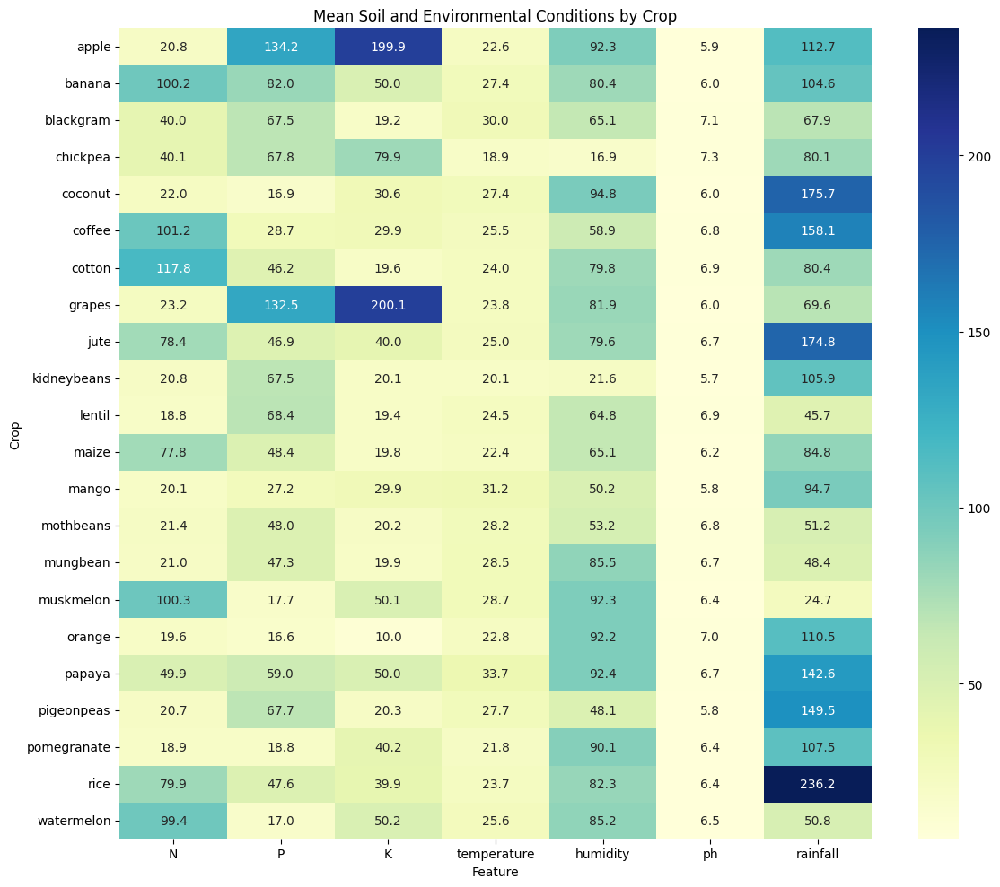
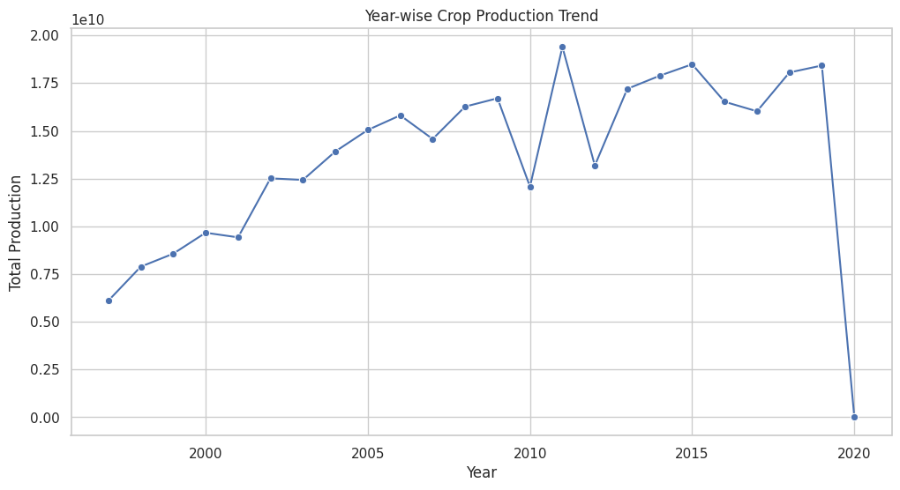
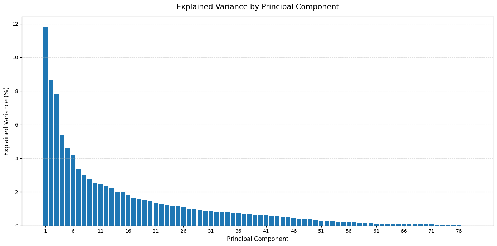

## 🌾 AgroInsight: Enterprise-Scale Agricultural Analytics Pipeline
An advanced, data-driven analytics engine designed to decode historical cultivation performance, analyze soil chemistry dynamics, and map out macro-environmental growth thresholds. This repository hosts Module 1 (Data Engineering & Exploratory Intelligence), processing multi-source data across three separate relational dimensions to lay down production-grade feature pipelines for upcoming predictive modules.
## 📈 System Architecture & Progress

* Module 1: Data Diagnostics & Exploratory Intelligence Engine ➔ [RELEASED / ACTIVE]
* Module 2: Multiclass Environmental Crop Recommender API ➔ [INTEGRATION PHASE]
* Module 3: Macro-Yield Forecasting & Trend Engine ➔ [DEVELOPMENT ROADMAP]

------------------------------
## 📊 Heterogeneous Data Ecosystem
The analytical engine ingestion pipeline synthesizes multi-source relational inputs across three distinct database schemas:
## 1. Macro-Level Crop Production Registry (crop_production_yield)

* Objective: Spatial-temporal cultivation efficiency modeling.
* Feature Schema: Geographic Tiers (State, District), Temporal Boundaries (Crop Year, Season), Spatial Allocation (Area in Hectares), Mass Volume Outputs, and calculated Production Efficiency (Yield Index).

## 2. Micro-Environmental Soil Profile Metrics (Crop_recommendation)

* Objective: Biochemical boundary setting and optimal condition pairing.
* Feature Schema: Soil Chemistry Matrix (Nitrogen N, Phosphorus P, Potassium K), Climatic Metrics (Ambient Temperature, Relative Air Humidity %, Precipitation Volumes in mm), and Soil Acidity Indices (pH matrix).

## 3. Hyper-Local Seasonal Crop Production Matrix (District-wise Crop Statistics)

* Objective: High-density longitudinal analysis of specialized crops from 1966 onward.
* Feature Schema: Micro-administrative boundaries linked to high-resolution cross-sectional performance metrics (Area, Production, Yield) for ~23 distinct crop classifications including specialized staple grains (Rice, Wheat) and dryland crops (Kharif/Rabi Sorghum, Pearl Millet).

------------------------------
## 🔍 Core Analytics & Statistical Visualization Engine
The Module 1 pipeline performs heavy data sanitation, extreme value outlier handling, and cross-dataset statistical validations.
## 🔬 Biochemical Clustering Diagnostics
Statistical evaluation of N-P-K distributions shows distinct chemical separations required by different plant species.

!

## 🌦️ Climatic Variable Interaction Plots
Multi-dimensional feature boundaries illustrating how temperature, moisture, and rainfall interact to form localized crop tolerance zones.

## 📈 Multivariate PCA Analysis 
Scree plot illustrating the percentage of explained variance across principal components to reduce dimensionality across the 23+ cross-sectional crop features.

------------------------------
## 🛠️ Technology Stack & Dependencies

* Core Engine: Python 3.10+
* Cloud Environment: Google Colab
* Data Processing Pipeline: Pandas, NumPy
* Data Visualization Frameworks: Matplotlib, Seaborn

------------------------------
## ⚙️ Ingestion & Deployment Guide## Running via Google Colab (Recommended)
This project is fully optimized for cloud execution via Google Colab.

   1. Click the Open in Colab badge inside the notebook file or manually upload the .ipynb file to your Google Drive workspace.
   2. Upload the raw datasets (crop_production_yield.csv, Crop_recommendation.csv, and District-wise Crop Statistics.csv) directly to your Colab session runtime or mount your Google Drive:
   
   from google.colab import drive
   drive.mount('/content/drive')
   
   3. Run all cells sequentially to execute data cleaning, processing pipelines, and visual transformations.

------------------------------
## 🗺️ Project Pipeline Roadmap

* Establish extraction, transformation, and unit standardization pipelines across all source schemas.
* Complete comprehensive univariate, multivariate, and correlation diagnostics.
* Deploy cloud-optimized visualization assets charting longitudinal trends and spatial clusters.
* Connect Module 2 classification microservices (Random Forest / LightGBM) for automated crop recommendation matrices.
* Deploy Module 3 time-series statistical models for multi-year yield forecasting.

------------------------------
To finalize your repository layout for a clean resume look, would you like help writing a clean Google Colab "Open in Colab" markdown badge link, or a suggested folder hierarchy template for your repository files?

